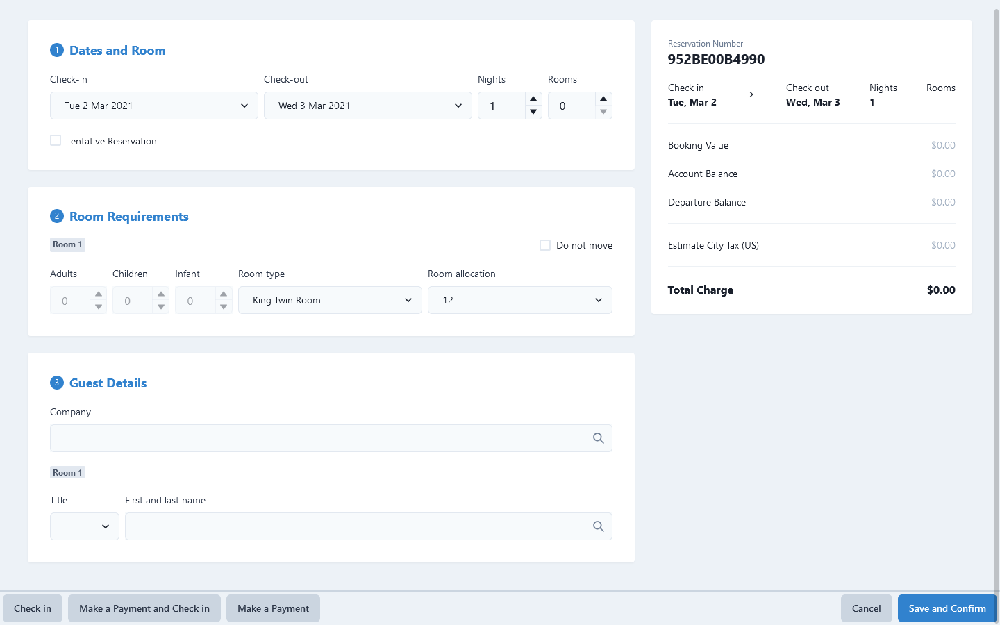
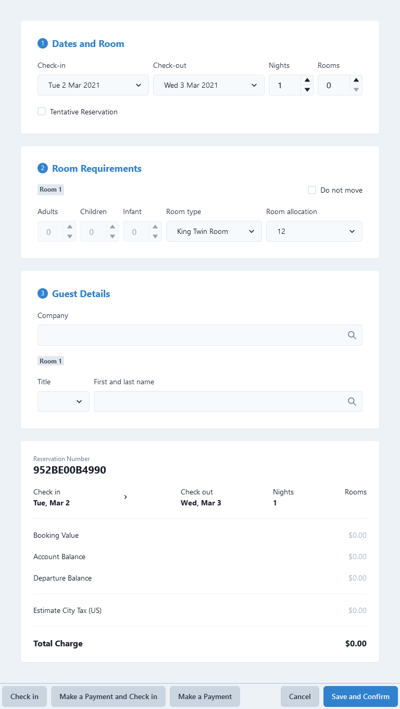

# SocialPinpoint Technical Exam - Prototype Dashboard from Mockup

The following is a prototype dashboard created in accordance to the mock-up and technical brief provided by SocialPinpoint as part of their technical exam for their React developer position.

## Links

-   Live Demo: [GitHub Pages](https://n-nikolaev.github.io/socialpinpoint-tech-test)
-   Project Repository: [GitHub Repository](https://github.com/N-Nikolaev/socialpinpoint-tech-test)

## Screenshots

**Desktop View (1440px)**



**Tablet View - Ipad (768px)**



## Installation

1. Clone the repository

    ```sh
    git clone https://github.com/N-Nikolaev/socialpinpoint-tech-test.git
    ```

2. Install the application

    ```sh
    npm install
    ```

    or

    ```sh
    yarn
    ```

3. Run the application

    ```sh
    npm dev
    ```

    or

    ```sh
    yarn dev
    ```

## Features

-   [x] Input cards gather input through interactions
-   [x] Output cards display gathered input
-   [x] Feedback on Taskbar button interactions
-   [x] Tablet responsive
-   [ ] Mobile responsive

## Technologies Used

-   [Vite](https://vitejs.dev/) - Build Tool
-   [TypeScript](https://www.typescriptlang.org/) - Static Typing Language
-   [ReactJS](https://reactjs.org/) - JavaScript Library / Framework
-   [Chakra](https://chakra-ui.com/) - Modular Component Library

